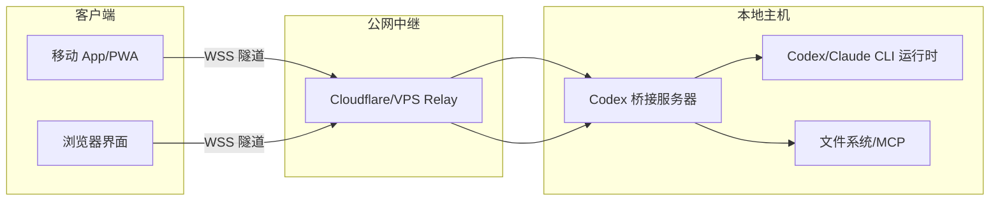
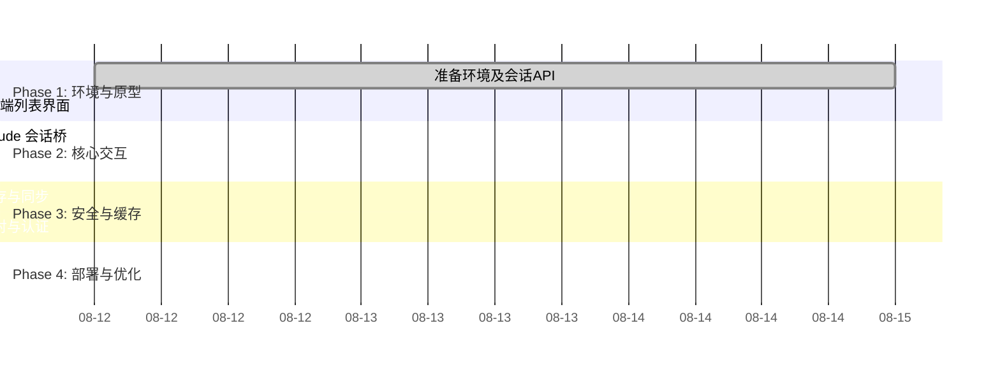

# 当前实施状态（以代码与测试为准）

| 状态 | 能力 |
|---|---|
| **完成** | Codex-only app-server `initialize`、thread list/read/start/resume、turn start/interrupt；rollout fallback；规范化事件、SQLite 全局单调 cursor、WebSocket 推送；真实 create/send/cancel；同 thread 串行与 active-turn 409；审批 request/decision correlation、进程 epoch 失效、重复决策防护；JSON-RPC malformed line 隔离、pending 在进程退出时拒绝、请求超时；API 输入验证与 404/409/422/503/504 映射；`spawn shell:false`；cwd 存在性、`realpath` 与 allowlist 边界；loopback-only 配对码生成；受限 CORS。 |
| **完成（基础范围）** | Vue 响应式桌面侧栏/移动抽屉、空态/详情/composer 状态、流式时间线、工具/状态/Diff 卡片、明暗主题；Dexie transcript/event/cursor/outbox；重连先 sync，再保持 `client_id` 按会话顺序 replay，单会话失败不阻塞其他会话；未知事件安全降级；Markdown/XSS 清理；只读审批 UI 按钮禁用且不调用 decision；Service Worker 只缓存静态资产，不缓存 `/api`/`/ws`。 |
| **部分完成** | 审批 request/decision 已完成，但额外权限授予仍只能在本机 Codex 处理，且审批不进入离线 outbox；离线仅覆盖 transcript 和消息 outbox；富文本已含 Markdown/KaTeX/常用代码高亮但非完整富媒体；配对使用短期 access token 与轮换 refresh token，但 refresh token 仍存 `localStorage`；Codex CLI 0.147.0 的命令/stdio 能力已探测，未执行会触及真实会话的 smoke。 |
| **未完成** | E2EE、Cloudflare/VPS Tunnel/relay、Capacitor/native、push、设备密钥/Keystore、安全 refresh 存储、完整文件管理、zstd rollout、超大历史增量索引。不得把配对令牌、部署层 TLS 或 PWA 视为这些能力已完成。 |

## 最终验收记录

- Git 仓库当前为 `No commits yet on master`，所有项目文件均为 untracked；因此只能记录当前状态，不能提供可靠基线 diff。
- 自动验证：server 8 tests + web 8 tests，共 16 tests；`npm test`、`npm run typecheck`、`npm run build` 全通过。
- 生产构建：169 modules；主要 JS chunk 为 index 31.91 kB、vue 67.67 kB、storage 96.61 kB、render 304.28 kB（gzip 11.99/26.78/32.50/104.95 kB）；PWA precache 10 entries，539.58 KiB。
- 本机协议探测：`codex-cli 0.147.0`，`codex app-server` 默认 `stdio://` 且支持协议 schema/binding 生成；fake app-server 覆盖当前使用的 initialize/thread/turn 方法形状。为避免修改真实会话，未执行真实 `thread/list`/initialize smoke。
- 视觉 smoke：本轮未完成浏览器桌面/手机 viewport 自动化，不声称已执行；以组件测试、静态审查和生产构建通过作为替代证据。
- 下一阶段最高优先级：迁移 refresh token 到设备密钥或更安全存储；随后做真实浏览器多 viewport smoke。

# 执行摘要

本方案借鉴现有开源项目，构建一个自托管的 “Codex 个人服务器 + 移动端/PWA 客户端” 系统。核心思路是：电脑端运行类似 **CC Pocket** 的代理桥（Bridge Server），管理 Codex/Claude 会话并通过 WebSocket 向客户端推送事件；客户端采用响应式 Web UI（借鉴 **Yep Anywhere** 等前端）或原生包装，支持 Markdown/LaTeX/代码高亮等完整渲染。配对认证采用一次性配对码绑定设备方式（无需扫码），并生成长期密钥认证设备登录；离线缓存使用 IndexedDB/SQLite 保持会话历史，断网后依然可查阅和排队发送消息。公网访问通过 Cloudflare Tunnel 或 VPS Relay 实现端到端加密传输。总之，系统结合 **CC Pocket** 的会话控制和文件浏览、**Yep Anywhere** 的多会话管理与远程访问、**Open WebUI** 的现代前端渲染技术，以**自托管、安全性高**为目标。下图给出了系统概览架构：客户端（手机 App 或浏览器 PWA）通过 WebSocket（可经中继服务）连接到电脑端的 Codex 桥接服务器，该服务器再与本地 Codex CLI 实例及文件系统交互。  



**图示：系统架构示意（手机/浏览器客户端 ←→ WebSocket/Tunnel 中继 ←→ 本地 Codex 桥接服务器 和 CLI）**。该架构结合了 CC Pocket 的桥接模型与 Yep Anywhere 的多会话管理，并通过中继服务支持公网访问。

# 1. 详细目标清单

以下按功能模块、API、事件、数据、认证、缓存、安保等方面罗列具体目标（供 AI 开发者参考）：

- **会话管理模块**：支持列举、创建、删除和查看会话。客户端可查看本机 Codex/Claude CLI 创建的所有活跃会话。每个会话包含会话 ID、模型类型（Codex/Claude）、状态（active/paused）等元数据。设计 API：例如 `GET /sessions` 返回 `[{session_id, model, status,...}]`，`POST /sessions` 创建会话（请求体指定 model）。会话持久化可使用 SQLite 或文件保存。

- **实时事件流**：使用 WebSocket 推送会话中的增量事件，核心事件类型包括：用户消息（`user_message`）、助手消息增量（`assistant_delta`）、工具调用（`tool_call`）、工具结果（`tool_result`）、MCP 调用（`mcp_call`，如文件系统操作）、MCP 结果（`mcp_result`）、文件变更（`file_change`，携带 diff/补丁）等。每条事件携带 `session_id` 以关联会话。例如：
  ```json
  {"type":"assistant_delta","session":"s1","role":"assistant","content":"继续分析…"}
  {"type":"tool_call","session":"s1","tool":"shell","args":["ls"]}  
  {"type":"tool_result","session":"s1","tool":"shell","output":"file.txt\n","success":true}  
  {"type":"mcp_call","session":"s1","mcp":"filesystem","command":"read_file","args":{"path":"file.txt"}}  
  {"type":"file_change","session":"s1","path":"notes.txt","change":"+++  更新: 增加了摘要"}  
  ```
  该设计参考 OpenAI 功能调用格式和 CC Pocket 的审批流程。

- **REST API 规范**：除了 WebSocket 外，还提供 HTTP 接口供查询和控制。例如：  
  - `GET /sessions`：列出所有会话。  
  - `GET /sessions/{id}`：获取会话详情（包含历史消息）。  
  - `POST /sessions`：创建会话（输入 JSON: `{"model":"codex"}`，返回新会话 ID）。  
  - `POST /sessions/{id}/messages`：发送用户消息（请求`{"role":"user","content":"..."}`），服务器转为相应事件。  
  - `POST /sessions/{id}/approve`：批准工具调用或文件更改等（如对内容修改确认）。  
  - **示例**：

  | 路径/方法                  | 功能描述               | 输入/输出示例                                                         |
  |--------------------------|--------------------|---------------------------------------------------------------------|
  | `GET /sessions`          | 列举所有会话           | 返回 `[{session_id:"s1",model:"codex",status:"active"},...]`         |
  | `POST /sessions`         | 创建新会话            | 请求 `{"model":"claude"}`，返回 `{"session_id":"s123"}`            |
  | `POST /sessions/{id}/messages` | 发送用户消息到会话     | 请求 `{"role":"user","content":"请解释这段代码"}`                    |
  | `POST /sessions/{id}/approve`  | 对请求批准           | 请求 `{"type":"file_change","approve":true}`                         |

- **数据模型**：定义清晰的 JSON 模式（JSON Schema），例如  
  ```json
  {
    "Session": {"session_id":"s1","model":"codex","status":"active","created_at":"2026-08-10T12:00:00Z"},
    "Message": {"session_id":"s1","role":"user","content":"Hello","timestamp":"..."},
    "ToolCall": {"session_id":"s1","tool":"shell","args":["ls","-la"]},
    // 等等
  }
  ```
  数据库（SQLite）建议设计表格：会话表(`sessions`)、消息表(`messages`，包括 content、role、timestamps) 和文件更改表(`file_changes`)等。字段示例：`messages(session_id, msg_id, role, content, timestamp)`，`file_changes(session_id, change_id, path, diff, timestamp)`。

- **认证/配对流程**：设计安全的设备绑定流程。首次连接时，电脑端生成一次性配对码（如4-6位代码）或二维码，用户在手机App/PWA输入该码请求绑定。电脑弹窗确认授权后，生成设备密钥对并记录入`authorized_devices`。以后客户端自动携带私钥登录，无需再输入。配对码可设置过期时间（例如5分钟）。这类似 GitHub 设备流或 VSCode Remote 的授权模式，避免传统账号密码。实现：`POST /pair/request`携带配对码，服务器确认后返回 `refresh_token` 等。注意绑定后仅颁发短期访问 token（例如30分钟），长期凭借绑定设备 ID 和刷新 token 自动续期。

- **离线缓存与同步策略**：客户端需支持离线查看和消息排队。设计 IndexedDB 同步：所有会话历史和消息都缓存到本地数据库，断网时依然可阅读旧消息和离线排队发送新消息。重连后自动同步：使用消息ID或时间戳仅传输增量数据。建议建立同步标记（cursor/token）以跟踪已同步位置。示例：本地存储表`messages`，每条消息添加状态`pending`或`sent`；离线时新消息标记为`pending`，网络恢复后再尝试发送。

- **安全策略**：通信全程加密（WSS + Optional TLS）。严控权限：浏览器端不存储长期凭证，只用短期 session token；需要至少双因素绑定（设备密钥+密码/配对码）。确保服务器不存明文凭证，存储仅长期公钥/设备ID。重要 API（如会话创建、文件读写）需要校验请求来源和设备绑定状态。可参考 CC Pocket 的无账户设计，只信任已授权设备。

- **部署与运维要点**：建议使用 Docker 容器部署主服务器，并通过 Cloudflare Tunnel 或自有 VPS 中继实现远程访问。无需暴露公网端口，主机启动后主动连接中继。提供常用运维命令（如 systemd 服务配置）。记录日志和健康检查接口，以便监控。文档中提到 Yep Anywhere 和 Happy 均使用 Node.js 和 WebSocket 服务，可借鉴其部署经验。

- **测试用例 & 验收标准**：编写 E2E 测试场景，例如：  
  1. 启动电脑端桥接，无客户端，确认 CLI 能正常创建会话。  
  2. 客户端输入正确配对码后完成绑定；错误码拒绝。  
  3. 客户端发送消息，服务器正确转发给 Codex，收到回复事件。  
  4. 边做边断网，客户端缓存消息；恢复后自动同步。  
  5. 使用工具调用（如 `!shell`）检查 `tool_call`/`tool_result` 完整性。  
  6. 测试文件上传下载、网页功能与手机 UI 渲染兼容。  
  验收时以功能完整、跨平台稳定为标准，且安全认证、离线等关键特性均需验证通过。

# 2. 开源仓库整合建议

下表列出各项目中可供复用、改造或重写的模块（仓库地址见注）：

- **kzahel/yepanywhere**（[源码](https://github.com/kzahel/yepanywhere)）  
  - *复用*：后端服务 `packages/server` 和 `packages/shared` 中的会话发现、CLI 对接及实时流设计，可作为基础 Session Manager。无需账号/数据库设计，符合本地自托管理念。  
  - *改造*：前端 `packages/client` 采用 React，实现了多会话和审批流程，可借鉴其组件结构（如 Session 列表、Diff 视图）但需要重构为移动聊天界面。  
  - *重写*：现有 UI 偏向控制台风格，不直接支持 LaTeX/Markdown 渲染，需要替换渲染器。可参考其 WebSocket 协议设计，但对工具调用等新事件类型要自行添加。  
  - *关键路径*：关注 `packages/server/src`（会话路由、WebSocket处理）和 `packages/client/src/components`（UI组件）。

- **K9i-0/CC Pocket**（[源码](https://github.com/K9i-0/ccpocket)）  
  - *复用*：Bridge Server (`packages/bridge`) 极为关键，负责启动 Codex/Claude CLI 并通过 WebSocket 与移动端通信。其中 `src/index.ts`、`src/session.ts` 等实现了会话生命周期和CLI输出推送，可大幅借鉴。该模块同时实现了文件浏览、Diff 查看、MCP（工具）请求审批等流程。  
  - *改造*：其 Flutter/原生客户端无需使用，但业务逻辑（如审批流程逻辑、文件变更记录）可以在新前端复制。认证流程改为配对码模式，可保留原有离线重连和消息队列机制。  
  - *重写*：UI 部分完全替换为 Web/PWA 实现；身份绑定由 QR 码改成配对码（无需摄像头）。多语言语音输入等功能可择性忽略或使用浏览器能力替代。  
  - *关键路径*：`packages/bridge/src` 内的 WebSocket 通信协议和 CLI 交互逻辑（文件 `cli-args.ts`、`bridge-port.ts`、`websocket.ts`）值得研究。

- **friuns2/codex-mobile**（[源码](https://github.com/friuns2/codex-mobile)）  
  - *复用*：其 Vue 前端基本复制了桌面版 Codex UI（聊天、技能中心、文件浏览等）。可以借用 UI 布局和组件风格（如对话气泡、侧边栏导航）。后端 `codexapp`（Express + Vue 桥接）将 Codex Server 封装为 HTTP/WebSocket 接口，也可改造用于转发事件给前端。  
  - *改造*：将其独立 Express 服务与我们统一后端合并，只保留必要的路由。API 调用改为符合上文定义的协议。  
  - *重写*：其移动端适配较简单，若需多端一致，可能重用其 CSS 样式。完整功能（语音、技能卡片）根据需求二次开发。  
  - *关键路径*：`codexapp/` 目录和 `src/`（Vue 组件）展示了与 Codex CLI 交互的基本思路。

- **open-webui/open-webui**（[源码](https://github.com/open-webui/open-webui)）  
  - *复用*：主要复用其前端渲染技术堆栈：已集成 `markdown-it`、KaTeX、Mermaid、Shiki (代码高亮) 等。可直接利用这些组件或配置，实现消息内容的富文本渲染和交互（图表/流程图等）。  
  - *改造*：只取前端框架（Vue/Svelte 项目结构），精简为聊天专用界面。去除复杂的用户管理、插件系统、企业级功能，仅保留消息输入输出。后端逻辑完全不使用。  
  - *重写*：鉴于 OpenWebUI 较重，可逐步迁移其组件（如富文本渲染管道）到轻量前端工程。它的 PWA 配置和国际化（i18n）可参考。  
  - *关键路径*：参考其 `src/main.ts`、组件库文档，以及渲染相关的配置文件（比如 `vite.config.ts`, `postcss.config.js`）。

- **slopus/happy**（[源码](https://github.com/slopus/happy)）  
  - *复用*：Happy 的 `happy-server`（后端）和 `happy-wire` 部分实现了端到端加密数据传输，`happy-agent`/`happy-cli` 负责管理会话和转向网络模式。可以学习其加密通信和推送通知设计。  
  - *改造*：由于 Happy 依赖云端推送和自己品牌配置，只能借鉴其思路。前端 `happy-app` （React Native/Web） UI 界面和交互方式可参考，但需自行实现。  
  - *重写*：更倾向于“参考而非直接复用”，因为 Happy 功能繁多且商业定位，与本项目定位不同。核心可看其如何启动 Codex CLI（`happy-cli`）并接管流，作为设计参考。  
  - *关键路径*：`packages/happy-server` 用于加密数据同步，`packages/happy-app` 的界面元素，可浏览文档和组件库获取灵感。

上述建议优先依据各项目 README、源码和文档进行确认。例如，CC Pocket 源码中明确提到无需账户并支持离线队列，Yep Anywhere 强调会话多端协作且本地存储。整合时应首先阅读各库的架构说明和关键路径（如上表所示），再决定具体复用哪些文件/接口。

# 3. 分阶段执行流程（Phase1..Phase4）

以下按开发阶段分解任务，每阶段列出主要活动、输入输出、里程碑、风险及工时预估。

- **Phase1（基础搭建，~7人日）**  
  - **目标**：搭建开发环境，运行本地 Codex/Claude CLI；复现 CC Pocket Bridge 和简单客户端结构。  
  - **任务**：安装 Node.js（≥18）环境；搭建 Express 或 NestJS 框架；引入 WebSocket 库（如 ws 或 socket.io）；实现 `GET /sessions` 等基础 API；先完成 PC 端简单会话列表接口。前端初步选型（Vue3/Vite），实现登录配对码输入界面和会话列表视图。  
  - **输入/输出**：输入：现有部分源码参考（如 CC Pocket Bridge、Yep 服务器结构）。输出：可启动服务器并在浏览器/模拟器看到可连接提示；能够创建并列出虚拟会话。  
  - **里程碑**：完成环境搭建和基本的会话流动（创建、列出会话），并在前端展示列表。  
  - **风险**：架构决策误差（后端技术选型错误），缓解：参考已有项目 Node/TypeScript 生态，先写最小原型验证。  
  - **工时**：约 5–7 人日。

- **Phase2（核心功能，~10人日）**  
  - **目标**：实现 Codex CLI 会话管理和消息传输；对接工具调用和审批功能。  
  - **任务**：参考 CC Pocket，编写代码启动 Codex/Claude 进程并捕获标准输入输出；通过 WebSocket 向客户端转发 GPT 流式回答（`assistant_delta`）；实现用户消息下发到 CLI；设计并实现 `tool_call`/`tool_result` 事件（如支持 Shell、Python Runner 等）；实现 MCP 功能（如文件读写、Git 操作）的大致框架；前端对应渲染聊天消息和审批对话框。  
  - **输入/输出**：输入：Codex/Claude CLI 已安装，服务器与其可通信；输出：系统能够基于用户输入启动 AI 回答，并推送消息增量；能发起工具调用并显示结果。  
  - **里程碑**：手机/网页端可以正常与 Codex 会话交互（消息来回、工具调用审批）。  
  - **风险**：与 Codex/Claude CLI 兼容性问题，缓解：参考 codex-mobile 架构，尽可能使用官方 API 规范；开始阶段使用模拟内容测试。  

- **Phase3（离线与安全，~6人日）**  
  - **目标**：完善离线缓存、设备绑定及安全机制；优化用户体验。  
  - **任务**：在客户端加入 IndexedDB 同步模块（如 Dexie.js），缓存会话历史和待发送消息；实现离线模式下缓存读写；实现配对流程：电脑端生成配对码、手机输入后服务器提示授权、交换密钥；实现短期 Access Token + Refresh Token 与设备 ID 绑定；前端完成会话持久化缓存与自动重连逻辑；测试断网/重连恢复场景。  
  - **输入/输出**：输入：Phase2 完成的事件流功能；输出：离线模式生效，缓存历史可读，新消息可排队发送；多设备/多浏览器登录与绑定正常。  
  - **里程碑**：成功测试离线环境下历史读取及断网消息重发；至少一种备用公网接入方案（CF Tunnel）验证通过。  
  - **风险**：同步冲突或数据丢失风险，缓解：设计消息序列号/时间戳机制，严格幂等发送；离线队列逻辑充分测试。  

- **Phase4（打包部署与收尾，~4人日）**  
  - **目标**：完成跨平台发布，撰写文档，系统测试和优化。  
  - **任务**：使用 Capacitor 将前端打包为 Android/iOS 原生壳；实现开机自启或终端服务安装（如 systemd）脚本；配置 HTTPS 证书和反向代理；编写使用文档和运维指南；进行安全审核（依赖扫描）；测试边缘场景（长对话、并发、多用户）。  
  - **输入/输出**：输入：Phase3 完成功能；输出：Android 应用包/APK，PWA 可安装版本；Docker 镜像或可执行包用于服务器；项目文档和示例配置文件。  
  - **里程碑**：发布可安装的应用和 Docker 镜像；完成 GitHub 仓库 README 和部署文档。  
  - **风险**：移动端兼容性问题，缓解：优先测试主流设备；打包前确保前端使用 PWA 功能完整。  

总工时约 25–30 人日（粗略）。各阶段间应持续集成，保证功能逐步可用。下图展示了开发里程碑的时间线（仅示意）：



# 4. API 设计和事件示例

下面给出一些接口和事件的示例（JSON 格式）：

- **REST API 示例**（部分）：
  ```
  GET /sessions
    返回 [{ "session_id":"s1", "model":"codex", "status":"active" }, ...]
  POST /sessions
    请求 { "model":"codex" }，返回 { "session_id":"s123" }
  POST /sessions/s123/messages
    请求 { "role":"user","content":"请生成 Python 代码" }
    返回 202 Accepted（并通过 WebSocket 推送消息）
  POST /sessions/s123/approve
    请求 { "type":"tool_call","approve":true } （批准上一个工具请求）
  ```

- **WebSocket 事件流 示例**（JSON）：
  ```json
  // 助手回复增量
  {"type":"assistant_delta","session":"s1","role":"assistant","content":"下面是 Python 实现的示例…"}
  // 工具调用（Shell）
  {"type":"tool_call","session":"s1","tool":"shell","args":["ls","-la","/home/user"]}
  // 工具结果
  {"type":"tool_result","session":"s1","tool":"shell","output":"file1.txt\nfile2.txt\n","success":true}
  // MCP 调用（文件读）
  {"type":"mcp_call","session":"s1","mcp":"filesystem","command":"read_file","args":{"path":"file1.txt"}}
  {"type":"mcp_result","session":"s1","mcp":"filesystem","output":"Hello world!\n"}
  // 文件变更
  {"type":"file_change","session":"s1","path":"notes.txt","diff":"@@ -0,0 +1,2 @@\n+第一行\n+第二行\n"}
  ```

前端收到这些事件后，应根据 `type` 分发渲染逻辑，比如 `assistant_delta` 累积为完整回复、`tool_call` 在 UI 显示命令及等待审核、`file_change` 可在文件浏览器中高亮差异等。为了渲染效果，前端建议使用 **Markdown-It**+**KaTeX** 等库来解析消息内容，实现公式和流程图支持。

# 5. PWA/Capacitor 打包技术要点

- **PWA 与 Capacitor**：采用响应式 Web 前端，可通过 Capacitor（一种将 Web 应用包装为原生 App 的跨平台框架）生成 Android/iOS 安装包。PWA 应包括 Service Worker 以支持离线访问。前端应在登录界面（首次配对）后进入聊天主界面。

- **扫码/配对码流程**：由于浏览器扫码受限，改为显示配对码。PC 端服务器启动后打印或在 Web UI 显示一次性配对码；手机/网页客户端手动输入该配对码发送 `POST /pair/request`；电脑端验证后完成绑定。可参考 VS Code Device Flow 或 GitHub Device Login 模式。

- **长期密钥管理**：绑定后服务器生成设备 ID 与密钥对，客户端将私钥存储在安全存储（如 Android Keystore 或 iOS 钥匙串）；服务器只保留公钥。会话请求签名或使用 TLS 客户端证书证明身份。Token 可设计为：Access Token（短期、有设备绑定）+ Refresh Token（长期），令牌仅存服务器-side，客户端每次发送签名的设备ID。

- **离线缓存策略**：客户端推荐使用 IndexedDB（结合 Dexie.js 等库）保存会话和消息。离线时进入只读模式，所有对会话的修改（新消息、审批等）先写入本地队列；重连后自动发送这些 pending 请求。注意数据库结构与后端 SQLite 设计同步（例如消息的自增 ID 或时间戳一致性）。

- **推送通知**：可选使用浏览器 Push API 或移动端原生推送（通过 Firebase/OneSignal）提醒新回复。确保推送 payload 最小，仅包含会话 ID 等关键字，用户点击可唤醒 App 并加载相关会话。

# 6. 优先级建议与技术栈

- **功能优先级**：  
  1. 核心会话交互：确保客户端能稳定连接 Codex，会话消息正确收发。  
  2. 消息渲染：支持 Markdown/LaTeX/代码高亮，多媒体预览（图片等）。  
  3. 认证与配对：实现安全绑定流程，保证数据不外泄。  
  4. 离线能力：保证短暂断网后数据不丢失，用户体验平滑。  
  5. 公网访问：配置 Tunnel/VPS 方案，推广访问方式。  
  6. 其他如推送、UI美化、额外扩展（终端、多模型）可后续迭代。

- **技术栈推荐**：  
  - 后端 **Node.js + TypeScript**：借鉴 CC Pocket、Yep Anywhere 使用 Node 的实践，便于重用其部分代码和生态（Socket.IO、WS 模块）。可选框架：Express/Koa/NestJS。  
  - 前端 **Vue 3 + Vite**（或 React + Vite）：快速构建响应式界面，结合 TailwindCSS 等提升开发效率。Vue 社区也出色支持 PWA。  
  - 跨平台容器 **Capacitor**：将 PWA 打包为原生应用，同时保留 Web 模式。  
  - 数据存储：服务器端使用 **SQLite**（简单、文件式，不需额外安装）；客户端使用 **IndexedDB** + Dexie.js（或 Capacitor SQLite 插件）存储历史消息。  
  - 通信协议：WebSocket（首选 Socket.IO 或原生 ws）+ REST API。  
  - 其他：版本控制 GitHub、CI/CD 可用 GitHub Actions 自动构建和镜像发布；使用 PM2 或 Docker 监控服务进程。  

总体而言，本项目倾向 Node/TypeScript 方案以最大化复用经验丰富的 CC Pocket/Yep 代码库，但也可根据开发团队熟悉程度选择 Python/FastAPI 等技术。关键在于清晰定义协议和模块边界，借鉴现有方案并结合实际需求定制实现。

**参考资料：** CC Pocket 文档、Yep Anywhere 说明、Open WebUI 功能介绍等。上述引用帮助验证和补充设计思路。
